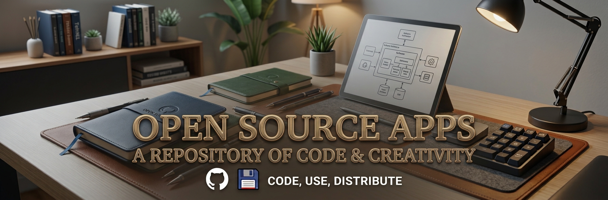

# Open-Source-Apps
**Gnome apps** and other **open source** software that I find interesting or useful, in **AppImage** format.

---

Apps included so far:

* **Blanket-x86_64.AppImage** **[Download](https://github.com/Uthopik/Open-Source-Apps/releases/download/v1.0/Blanket-x86_64.AppImage)**                      [Official website](https://github.com/rafaelmardojai/blanket)
* **Calculator-x86_64.AppImage** **[Download](https://github.com/Uthopik/Open-Source-Apps/releases/download/v1.0/Calculator-x86_64.AppImage)**                   [Official website](https://gitlab.gnome.org/GNOME/gnome-calculator)
* **Characters-x86_64.AppImage** **[Download](https://github.com/Uthopik/Open-Source-Apps/releases/download/v1.0/Characters-x86_64.AppImage)**                   [Official website](https://gitlab.gnome.org/GNOME/gnome-characters)
* **Clocks-x86_64.AppImage** **[Download](https://github.com/Uthopik/Open-Source-Apps/releases/download/v1.0/Clocks-x86_64.AppImage)**                       [Official website](https://gitlab.gnome.org/GNOME/gnome-clocks)
* **Evince-x86_64.AppImage** **[Download](https://github.com/Uthopik/Open-Source-Apps/releases/download/v1.0/Evince-x86_64.AppImage)**                       [Official website](https://gitlab.gnome.org/GNOME/evince)
* **Fonts-x86_64.AppImage** **[Download](https://github.com/Uthopik/Open-Source-Apps/releases/download/v1.0/Fonts-x86_64.AppImage)**                        [Official website](https://gitlab.gnome.org/GNOME/gnome-font-viewer)
* **GtkHash-x86_64.AppImage** **[Download](https://github.com/Uthopik/Open-Source-Apps/releases/download/v1.0/GtkHash-x86_64.AppImage)**                      [Official website](https://github.com/gtkhash/gtkhash)
* **kolourpaint-x86_64.AppImage** **[Download](https://github.com/Uthopik/kolourpaint-appimage/releases/download/v19.12.3/kolourpaint-19.12.3-x86_64.AppImage)        [Official website](https://github.com/KDE/kolourpaint)
* **Logs-x86_64.AppImage** **[Download](https://github.com/Uthopik/Open-Source-Apps/releases/download/v1.0/Logs-x86_64.AppImage)**                         [Official website](https://gitlab.gnome.org/GNOME/gnome-logs)
* **Maps-x86_64.AppImage** **[Download](https://github.com/Uthopik/Open-Source-Apps/releases/download/v1.0/Maps-x86_64.AppImage)**                         [Official website](https://gitlab.gnome.org/GNOME/gnome-maps)
* **QR_Decoder-x86_64.AppImage** **[Download](https://github.com/Uthopik/Open-Source-Apps/releases/download/v1.0/QR_Decoder-x86_64.AppImage)**                   [Official website](https://gitlab.gnome.org/World/decoder)
* **Shortwave-x86_64.AppImage** **[Download](https://github.com/Uthopik/Open-Source-Apps/releases/download/v1.0/Shortwave-x86_64.AppImage)**                    [Official website](https://gitlab.gnome.org/World/Shortwave)
* **Simple-Scan-x86_64.AppImage** **[Download](https://github.com/Uthopik/Open-Source-Apps/releases/download/v1.0/Simple-Scan-x86_64.AppImage)**                  [Official website](https://gitlab.gnome.org/GNOME/simple-scan)
* **Upscaler-x86_64.AppImage** **[Download](https://github.com/Uthopik/Open-Source-Apps/releases/download/v1.0/Upscaler-x86_64.AppImage)**                     [Official website](https://gitlab.gnome.org/World/Upscaler)
* **Webcamoid-9.3.0-3-anylinux-x86_64.AppImage** **[Download](https://github.com/Uthopik/Open-Source-Apps/releases/download/v1.0/Webcamoid-9.3.0-3-anylinux-x86_64.AppImage)**   [Official website](https://github.com/webcamoid/webcamoid)

---

**Apps:**                                           https://github.com/Uthopik/Open-Source-Apps/releases

---

I have another repository dedicated to **open source games**. You can view it **[here.](https://github.com/Uthopik/Open-Source-Games)**

email: josearrillaga@ik.me
